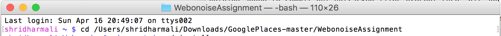
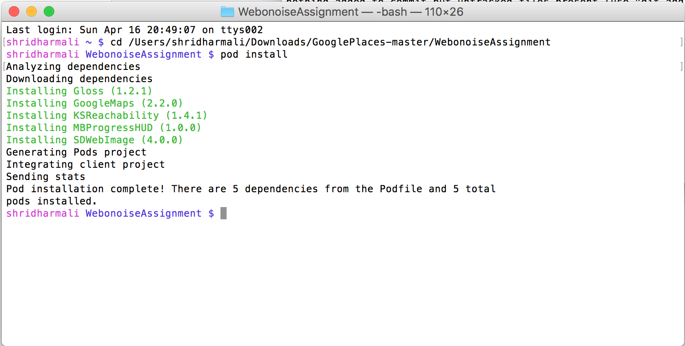
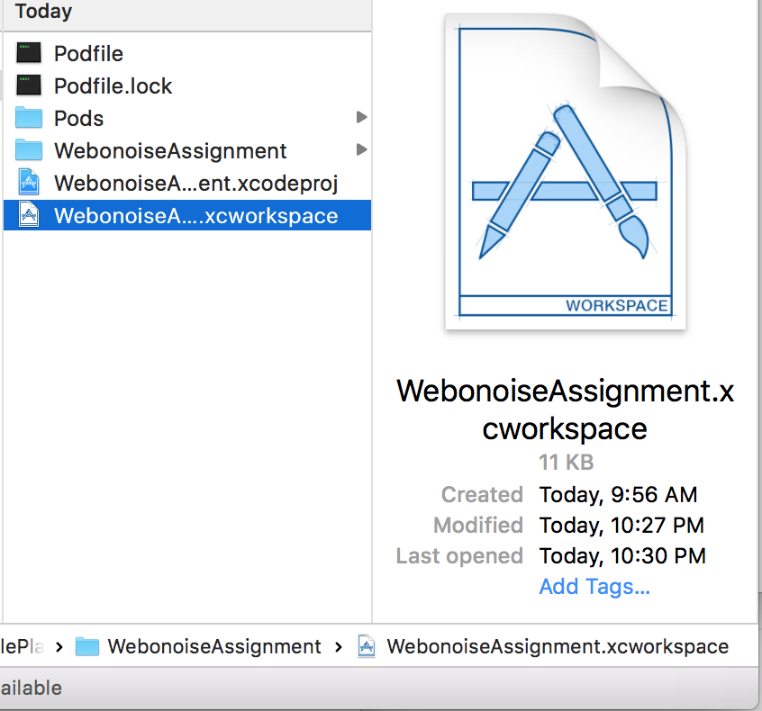
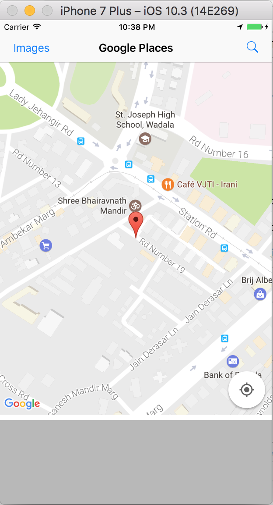
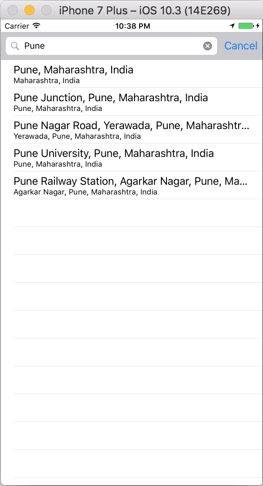
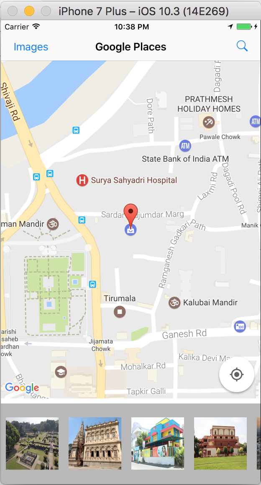
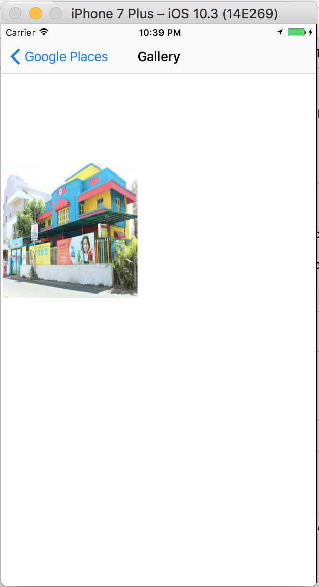

## Google Places API

### Steps

1) Download / clone project

2) Open terminal and navigate upto project folder
	
3) Type `pod install` in terminal and hit enter. All pod dependency will be installed. 

4) Once pod installed, Open(Double click on  `.xcworkspace` file)

5) Run application now.

6) Click on Search navigation right button icon for search places. Enter place text you will get 5 `Predictions` places from google place API 

For eg: 

7) Select any place from suggested search list and you will get the place details show on GoogleMap also place photos at the bottom. you can scroll horizontally for see more photos. Selected photo will be downlod in background and show on the image gallery screen

8) Click in `images` left navigation bar button. you will get list of downloaded images which is stored in device internal memory. 

